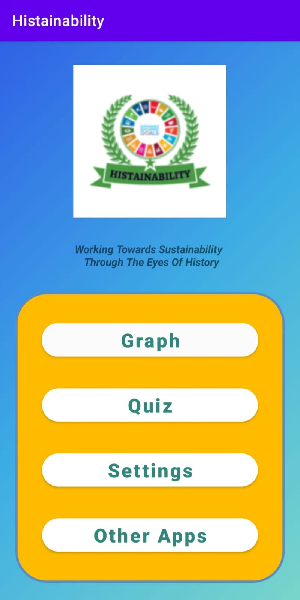
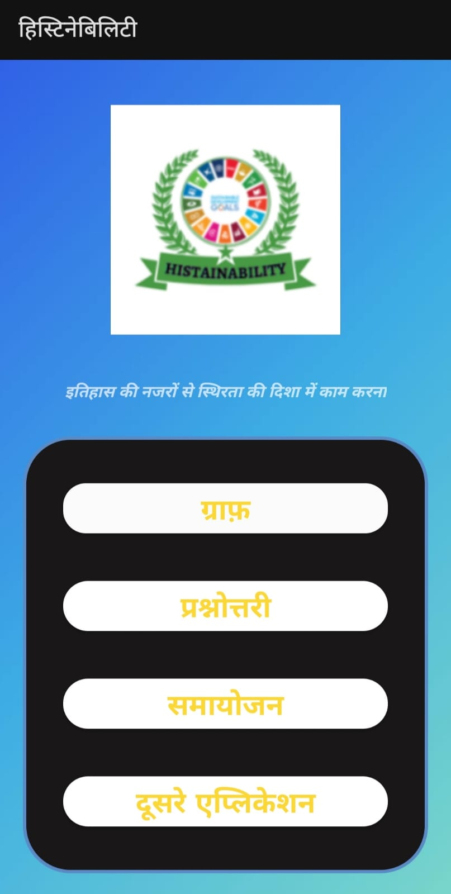
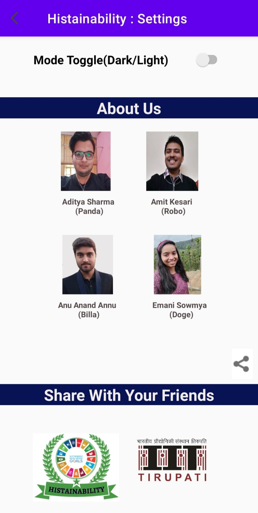

# Histainability

_Working towards sustainability through the eyes of history_

---

    
    
    

---

## Introduction

**Do you know** that in 2019, one in every ten people were suffering from food insecurity.
This is the main problem in this world, no one cares about the environment where they live in.
The issues which are not so important goes viral on social media and becomes a hot topic but the main challenges are not addressed and cared about.

As once a wise man said _that those who forget history are condemned to repeat it._

So, everyone needs to know about the difficulties and hurdles the world faced and is still facing. Also, understanding the trends and patterns of how these events mold our everyday society.

---

## Proposed Solution

The information collected from Google N-gram depicts historical reasons for changes in the trends discussing the 17 Sustainable Development Goals (SDG) provided by UN and tries to display a pattern on what are the events that had a positive or negative impact on the world. And what events made us think about these goals.

---

## Technical details

-   Our app has 4 components
    -   Graph
    -   Quiz
    -   Other Apps
    -   Settings

### Graph

-   App displays a list of 17 goals and user can select any of the interested goal.
-   Once you select a SDG for information, it makes and **API call to Google N-Grams**
-   Recives data in **JSON format**, which is parsed and converted into Kotlin object.
-   That data is plotted in graph on UI along with **Event cards**
-   Each Event card contains information regarding historical event which had a significant impact on the way people think about that particular SDG
-   This tries to plot and analyse the patterns in the events which had a positive/negative impact.

### Quiz

-   Once user is aware of the events, he/she can test this knowledge with the help of quiz we prepared
-   User can again select a SDG and then take the quiz and find result

    
<!--  -->

### Other Apps

-   This section contains other informative apps about SDG

### Settings

-   For better user experience we implemented dark and light mode feature
-   We also implemented multi language system (Hindi/English/Telugu) in our app to increase useability and accessability

---
#### Demo video for HISTAINABILITY
    https://drive.google.com/file/d/1Nl-mF1uD1oDLJ0SD6HMOTOgBwFJQ0sER/view?usp=sharing

---
## Future Goals

-   Making graph more interactive
-   Question adding feature in quiz
-   Google login system so that schools/institutes can use it to teach kids and track progress of students
-   Making app available in other official languages of India
